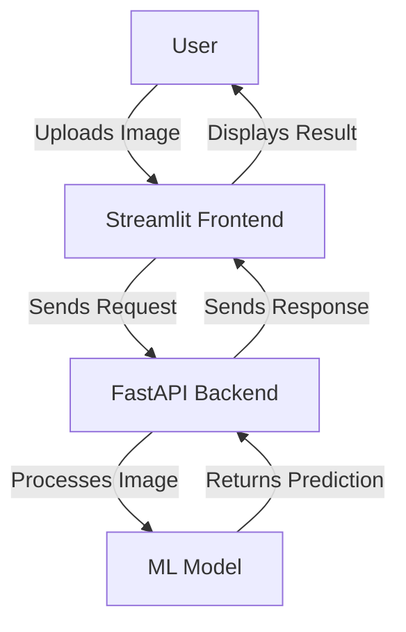

# 🏗️ Project Architecture

## Overview

Mango Ripeness Detection is a full-stack application with a clear separation between the frontend and backend components. The system is designed to be modular, scalable, and maintainable.

## System Architecture



## Component Details

### 1. Frontend (Streamlit)

**Location**: `app.py`

- **Purpose**: Provides a user-friendly interface for uploading mango images and viewing results
- **Key Features**:
  - Image upload and preview
  - Real-time prediction display
  - Responsive design for mobile and desktop
  - Interactive UI with feedback

### 2. Backend (FastAPI)

**Location**: `src/api/app.py`

- **RESTful API Endpoints**:
  - `POST /predict`: Accepts image uploads and returns predictions
  - `GET /health`: Health check endpoint
  - `GET /`: API documentation and information

### 3. Machine Learning Model

**Location**: `src/models/model.py`

- **Architecture**:
  - Base Model: EfficientNetB0 (pre-trained on ImageNet)
  - Custom Classification Head
  - Data Augmentation Layers
- **Training Process**:
  - Transfer Learning
  - Fine-tuning
  - Class Weight Balancing

### 4. Data Processing

**Location**: `src/data/preprocess.py`

- **Functions**:
  - Image loading and resizing
  - Data augmentation
  - Train/validation/test split
  - Data generator creation

### 5. Utilities

**Location**: `src/utils/`

- `visualization.py`: Plotting and visualization utilities
- `config.py`: Configuration settings
- `logger.py`: Logging configuration

## Data Flow

1. **Image Upload**: User uploads an image through the Streamlit interface
2. **Request Handling**: Frontend sends the image to the FastAPI backend
3. **Image Processing**: Backend processes the image (resize, normalize, etc.)
4. **Prediction**: Processed image is passed to the ML model
5. **Response**: Prediction results are sent back to the frontend
6. **Display**: Frontend displays the results to the user

## Dependencies

- **Backend**:
  - FastAPI
  - Uvicorn
  - TensorFlow
  - NumPy
  - OpenCV
  - Python-multipart

- **Frontend**:
  - Streamlit
  - Pillow
  - Requests

## Environment Variables

Create a `.env` file in the root directory with the following variables:

```env
# Backend
PORT=8000
DEBUG=True
MODEL_PATH=models/mango_ripeness_model.h5

# Frontend
BACKEND_URL=http://localhost:8000
```

## Deployment

The application can be deployed using Docker:

```bash
docker-compose up --build
```

Or directly with Python:

```bash
# Backend
uvicorn src.api.app:app --reload

# Frontend (in a new terminal)
streamlit run app.py
```
## Monitoring and Logging

- **Logs**: All application logs are stored in `logs/app.log`
- **Metrics**: Performance metrics are tracked using TensorBoard
- **Error Tracking**: Unhandled exceptions are logged with stack traces

## Security Considerations

- Input validation on all API endpoints
- Rate limiting to prevent abuse
- Secure file upload handling
- Environment variables for sensitive configuration
